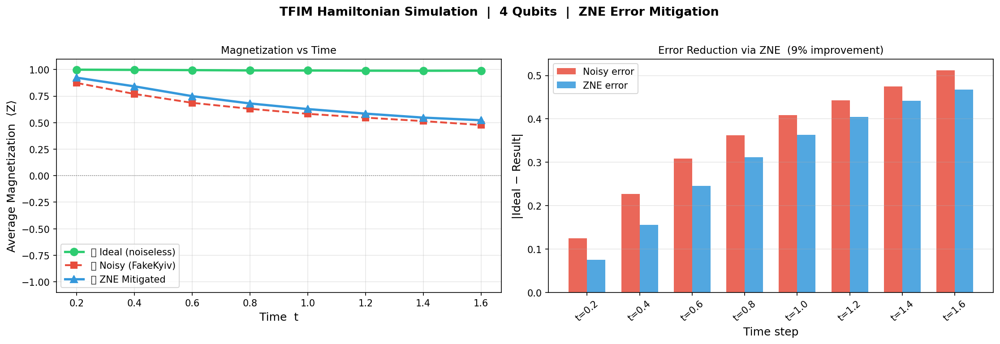

# TFIM Noise Mitigation on Real IBM Quantum Hardware

4-qubit Transverse Field Ising Model simulation with layered error mitigation 
(ZNE + TREX + Dynamical Decoupling) on ibm_fez and ibm_marrakesh.



---

## Results

Ran on real ibm_fez hardware, twice independently. Full mitigation improved 
all 8 time steps both runs.

| Mitigation | Avg Error | Improvement |
|---|---|---|
| Raw hardware | 0.072 | — |
| TREX only | 0.055 | 24% |
| DD + ZNE + TREX | 0.031 | 57% |

---

## What's in the notebook

- Trotterized TFIM circuit (J=1.0, h=0.1, 4 qubits, 8 time steps)
- Ideal simulation (noiseless baseline)
- Noisy simulation via FakeKyiv calibration noise model
- ZNE implemented from scratch via gate folding (1x, 3x, 5x)
- Real hardware jobs with 3 mitigation levels via Qiskit Runtime EstimatorV2
- FakeKyiv vs real hardware noise comparison

---

## Setup

```bash
pip install qiskit==1.4.2 qiskit-aer==0.15.1 qiskit-ibm-runtime==0.37.0
